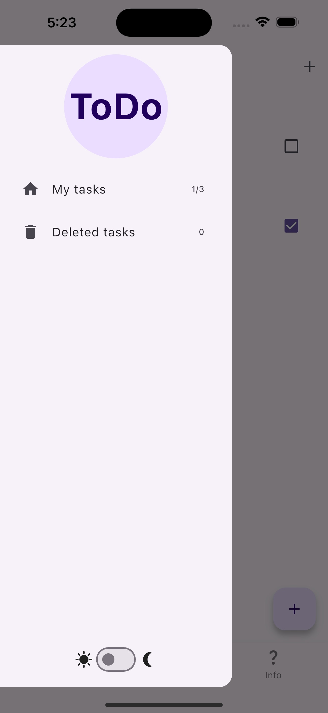
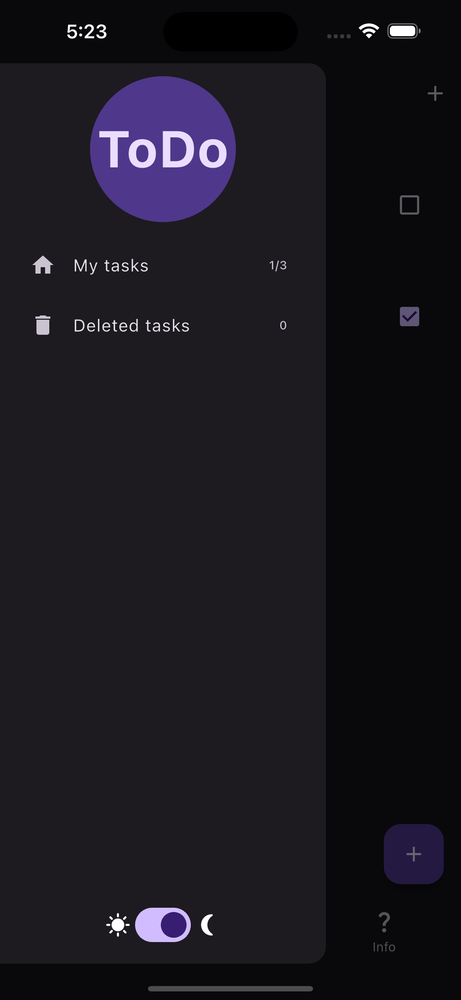
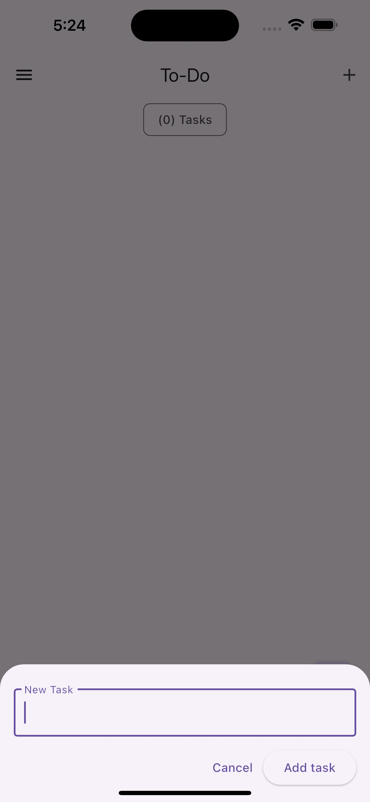
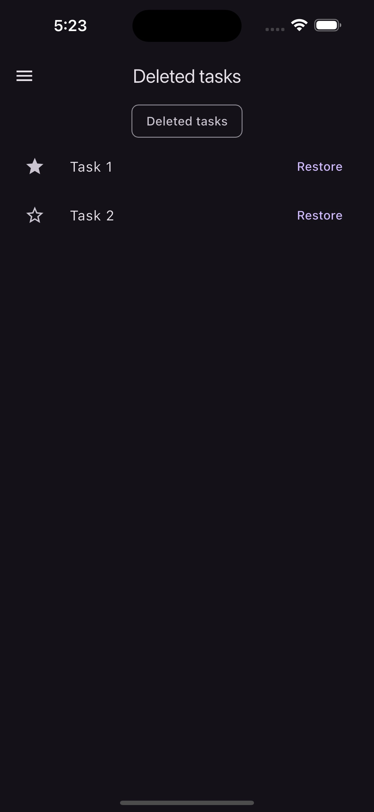

# To-Do List App using BLoC

## ✨ Features

-   Create/delete tasks
-   Mark tasks as "done"
-   Mark tasks as "important"
-   Separate view of the done and not done tasks
-   Separate screen for important tasks
-   Theme switcher
-   Move tasks to bin
-   Tasks permanent deleting

## 💻 Requirements

-   Any Operating System (ie. MacOS X, Linux, Windows)
-   Any IDE with Flutter SDK installed (ie. IntelliJ, Android Studio, VSCode etc)
-   A little knowledge of Dart and Flutter

## 🏃 How to Run

1. Open the Command Palette. Go to View > Command Palette or press Command + Shift + P.

2. Type flutter.

3. Select the Flutter: Select Device. If no devices are running, this command prompts you to enable a device.

4. Select a target device from Select Device prompt.

5. After you select a target, start the app. Go to Run > Start Debugging or press F5.

6. Wait for the app to launch. You can watch the launch progress in the Debug Console view.

## 📱 Screenshots

<table>
  <tr>
    <td></td>
    <td></td>
  </tr>
  <tr>
    <td></td>
    <td></td>
  </tr>
  <tr>
    <td></td>
    <td></td>
  </tr>
</table>

## 🎥 Demo Video
